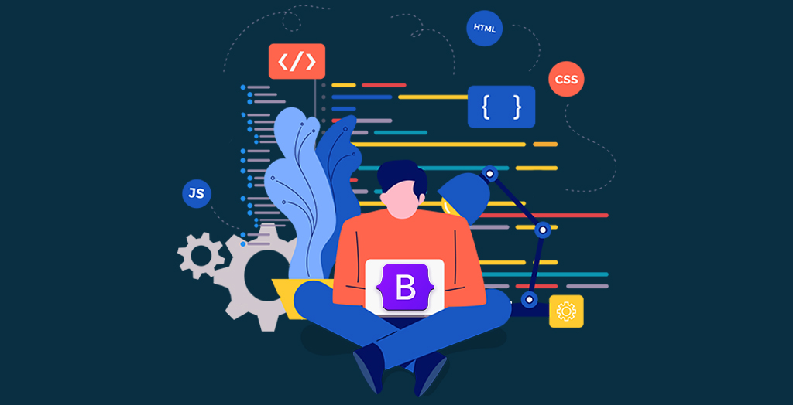

## Boot..straps? Huh?

UI Frameworks are very powerful when it comes to software development and in our case, website creation. With that being said, the complexities of learning how to utilize these frameworks, can bring up the question, why bother even using frameworks? Why can’t we just use the raw components of our language of choice? In this class, why should we even use something like Bootstrap 5? What even is Bootstrap 5?

## The Initial Dilemma

At first, I had no answers at all to these questions, heck I didn’t even know what a framework was. However, it wasn’t until we dabbled into raw HTML and CSS that I saw why we would need to use UI frameworks, more specifically Bootstrap 5. Long story short, but raw HTML and CSS just suck! Okay, maybe they aren’t extremely terrible languages, but just hard to implement due to the absence of pre-existing libraries. In raw HTML and CSS, you practically have to do everything! Nothing is set up, no existing libraries of classes that format what you want. Just imagine how complex it would be to structure a website from the ground up! That wouldn’t be fun at all... I remember my first couple of practice assignments with raw HTML and CSS, it was extremely hard to get things centered and exactly how I wanted them to. I would have a wonky and off-center header, or I would have a paragraph with no padding at all making it seem like it was stuck to the edge of my screen! The frustration I had with using raw HTML and CSS was immense!

## Bootstrap 5 to the Rescue!

The use of these pre-built classes and components through UI frameworks, allows us to create software through reusable and ready-to-use elements. Upon implementing a framework like Bootstrap 5, we can use classes and features that are available from such. Classes such as navbar, content-justify, etc. are just some of the classes we used so far. The use and implementation of frameworks have made it so that software developers can easily and more efficiently create applications. Frameworks allow us to skip the need to create standard functionalities in our applications, that are widely used. Just imagine if we didn’t have frameworks, and all of our resources were made purely from languages! It would be like we were still stuck in the past. With Bootstrap, we just need to implement it!

## Overcoming the Learning Curve

However, there’s an immense learning curve when it comes to using Bootstrap, and HTML and CSS are so different from what I am used to (Java, C++, and even Javascript), so simply using HTML and trying to understand its syntax structure, and also tagging along Bootstrap is difficult! Understanding what class does what, what features I can use, and how to write it in the correct syntax are just some of the things I have to think about and understand to fully utilize and be comfortable with when using Bootstrap 5. However, I think the return on investment with learning such is insanely high, as it is a very valuable skill to know and be able to utilize not just in creating website pages in class, but in all aspects of software. We can benefit from frameworks by creating beautiful applications, without having the immense headache of implementing structureless languages! So hooray for frameworks! 

## Do Coding Standards Make a Difference?

Overall, coding standards are a valuable skill to have. It’s a standard that forces one to adapt to a cleaner, readable code, which is important, especially in joint coding projects, and team settings. I think learning coding standards and implementing them with ESLint, while at the beginning a pain, is a very valuable skill that will greatly benefit us, coders, in the future. Who wants to be known as the coder that no one can understand?

**- ChatGPT used for paragraph headers**
