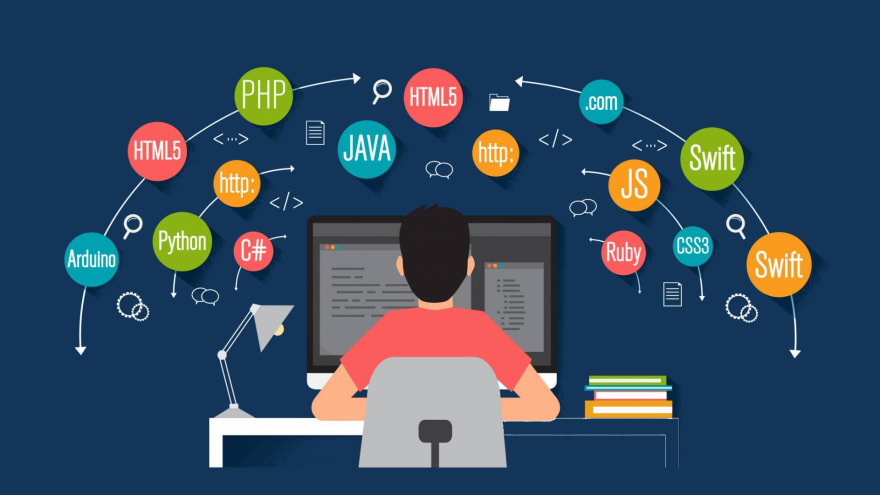

This year marks 2.5 years since I made the switch to major in Computer Science. After graduating from Maui High School in 2019, I was lost on what I wanted to do with my life.

## The Quest for Purpose

I went to university in 2019-2021, but I didn’t declare anything. I had this mundane attitude of “I'll figure everything out eventually,” however, 3 years went by and still nothing happened. It wasn’t until my mom introduced me to a person she met through her job, that I started gaining an interest in computer science and software engineering. He was a software engineer himself and gave me resources on introductory programming.

## Embracing Curiosity and Making the Leap

From here, I began getting more and more curious about such until I made the jump to switching my major and thus transferring to UH. In the time that elapsed from then, my love and passion for computer science continued to grow. I loved writing code, solving problems, and the idea of utilizing the resources of our computer to create anything. My interests in computer science and software engineering right now are scattered, I have an interest in cybersecurity (I know isn’t that code-heavy), web development, software development, cloud computing, and machine learning.

## Cultivating Love and Passion

My goals for the future are to find my true interest, through means such as internships and research opportunities, as well as the remaining classes I have left to take for my degree. In the future, I wish to develop and build more on my core skills of programming. Understanding the best ways to solve problems efficiently, as well as gaining skills to create effective and practical projects. Right now, I am learning a whole new language in 314, Javascript, which is a step in the right direction for me to gain the skills I need to achieve my goals in the future. While I may feel like a real newbie programmer still, I know that with time I will be able to excel and find my true passion in the world of technology.

- ChatGPT is used for creating the Title and Headers
