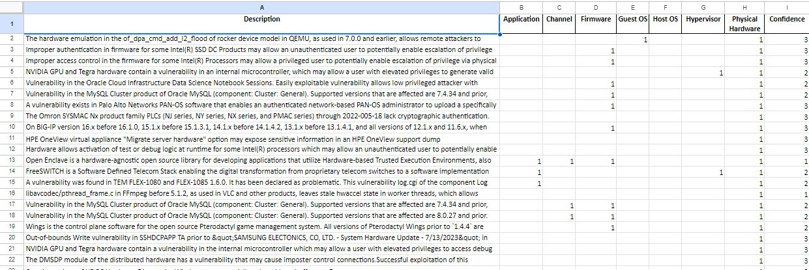

For the past couple of months (besides December) I have been allowed to be a part of a cybersecurity-based research project under Dr. Peruma, and graduate student Ana Arujo. My task, which is what is hinted at in my resume under my "Work" section, is taking sets of cybersecurity-related data, and determining what the threat is, based on the given concept's topic. 

Concepts include the context of the attack, whether was it a physical, firmware, hypervisor, etc. How we can mitigate the attack, through physical security, multifactor authentication, the sandbox, etc. What impact does the breach have? Does it give the attacker read accessibility, resource removal, or a denial of service? As well as the method of attack. Was it a remote, limited remote, local, or physical attack on a system? 

While my role on the team may just be annotations, I have learned a lot in a small amount of time. Skills such as problem-solving, communicating with your leader/mentor, and a multitude of cyber-related terms. I have learned how to manage my time, as with my role I am tasked to achieve a certain amount of annotations per hour, depending on how much I work that day, thus I developing upon my essential accuracy and proficiency skills.

