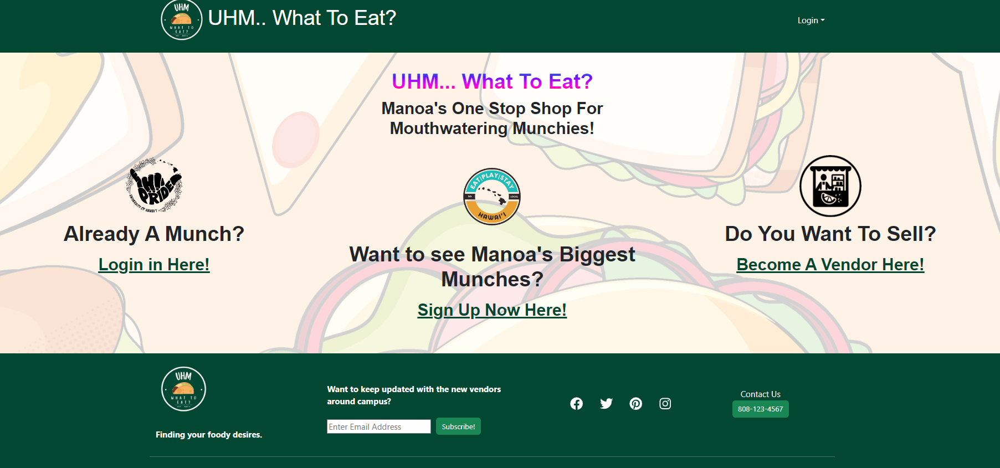
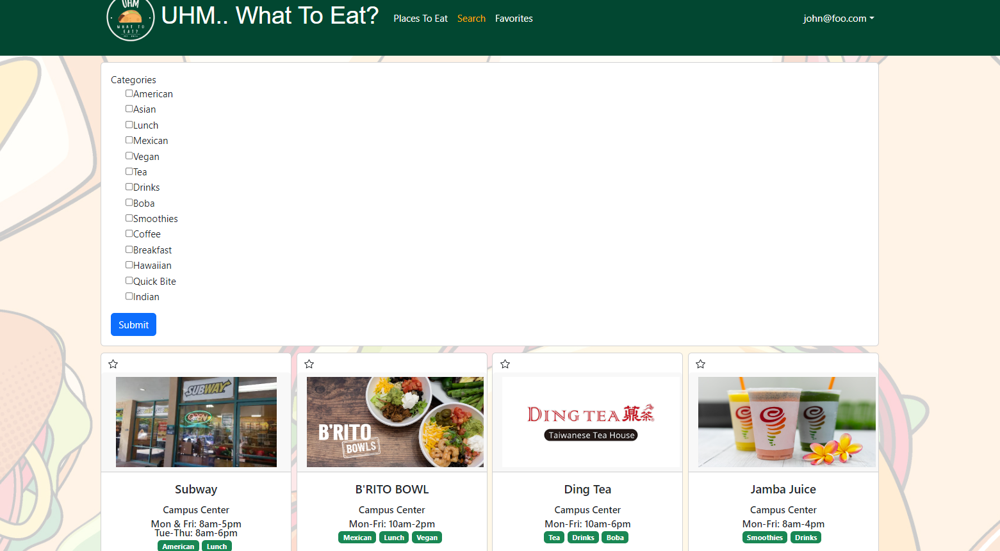

## Our Project
UHM... What To Eat, is a project me and my team created with the sole purpose of helping those who ask the question, UHM... what should I eat today? A food-search website dedicated specifically to the UH Manoa campus (hence the title), to display all the diverse and abundant food options that we have here on the UH campus. Our website was created to help narrow the search of where to eat, as well as provide as an easy way to set up a shop if you are a new vendor coming to campus! Giving accounts to both users and vendors, we created an easy-to-use page, that allows quick and straightforward access to a multitude of different features, with users being able to favorite vendors, search for specific shops, and provide the ability to manage your vendor as a shop owner.

## My Contributions
Throughout this project, I contributed in numerous segments, from the front-end design to back-end functionality. From the front-end, portion, I created the footer and implemented (and created) our logo, as well as different mark-up sections that can be seen in the above image. In addition, I also created the user sign-in, and sign-out, as well as formatted the vendor sign-up form. In terms of the back end, one of the big tasks and challenges that we had as a team, was making the vendor registration (sign-up) form, correctly sending the right information to our database of MongoDB, as well as creating and assigning the role of "vendor," to the roles collection. Our team had the problem of the vendor form, sending the right information to the database, but not giving the correct role. This was one of the harder portions of the project for me but allowed me to understand more about the MongoDB system, as well as Meteor. In addition to working on the MongoDB collections, I created the "search" page, which searches our database by the category tags provided to every vendor and returns only those that match all the specifically chosen tags. The search page is shown at the bottom of this page. One of the last things I contributed to this project, was creating all of the testcafe tests, which tested the sign-in (user and admin), sign-up user, as well as the sign-up vendor, and all of the pages loaded. I created roughly 15 tests in total, and our website was able to pass all of them.

## All in all...
This project to me, has been one of the best things I have probably done as an ICS major here at UH Manoa. I gained lots of experience not just from developing a project but being put in an environment where I am collaborating with my peers, creating ideas for our website, and then going out and creating a working one. This project also really tested me, as there were many endless hours of debugging, researching, and learning as I tried my best to apply everything I'd learned before this project, to use (testcafe, this section is for you). All in all, this was a project that allowed me to display my skills, and work in a software engineering environment, and am beyond happy with the result of it. Onto the next!

## Search Page:

### To Visit Our Website
Our Github [Repository](https://github.com/uhm-what-to-eat/source-code), [Project](https://uhm-what-to-eat.github.io/) Page, and Deployed [Website](https://uhmwhattoeat.online/) 

